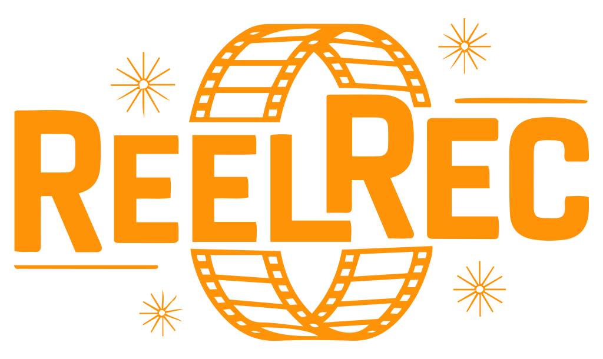

<div id="header" align="center">
  
</div>

# ReelRec: Your Personal Movie Recommender 🎬🍿

<div align="center">
  
  
[](https://www.java.com)  
[](LICENSE)  


</div>

**Tired of endless scrolling and still can't find a movie to watch?**  
ReelRec is here to rescue your movie nights! This powerful Java application acts as your personal movie guru by recommending films based on your preferences. Now available in two modes—a fully featured GUI application and a flexible CLI version—to suit your workflow.

---

## 🌟 About ReelRec

ReelRec is a movie recommendation system built with Java as part of the **CSE337s Software Testing** course at **Ain Shams University**.  
It leverages a simple genre-based recommendation engine:
- **GUI Application:** Enjoy a fully integrated window-based experience complete with a splash screen, configuration panel (with file browser support), and standard window operations.
- **CLI Application:** Run the application from the command line either non-interactively (via arguments) or interactively through console prompts.

**Key Features:**
- **Genre-Based Recommendations:** Suggests movies based on your favorite genres.
- **Robust Input Validation:** Checks and validates the format of your input files, reporting errors clearly.
- **Clean Output:** Generates a `recommendations.txt` file with personalized suggestions.
- **Dual Interface Options:** Choose between a user-friendly graphical interface and a quick command-line interface.
- **Cross-Platform:** Built in Java (JDK 8+), ensuring wide compatibility.
- **Tested for Reliability:** Developed with a strong emphasis on unit, integration, and system testing.

---

## 🚀 Getting Started

### Prerequisites
- **Java Runtime Environment (JRE) 8 or higher** – Download from [Java.com](https://www.java.com).

### Installation

1. **Clone the Repository:**
   ```bash
   git clone https://github.com/yourusername/ReelRec.git
   cd ReelRec
   ```

2. **Build the Project:**
   Use Maven to compile and package the project:
   ```bash
   mvn clean package
   ```
   After building, you’ll find the following file in the `target` directory:
    - `reelrec-1.0.jar` (this is the GUI application)
  
   In case you want to run the CLI version, can edit the `pom.xml` file to include the CLI module and build it as well.
   > [!NOTE]  
   > This can be done by setting `mainClass` to `ReelRecCLI` in the `pom.xml` file.

3. **Default Input Files:**
   The `resources` folder contains sample input files:
   - `movies.txt`
   - `users.txt`
  
  - This folder is not created automatically during the build process, so you need to create it manually.

> [!TIP]
> Alternatively, you can use the pre-built release files available in the [`releases`](https://github.com/dizzydroid/ReelRec/releases) section of the repository:
> - Download the latest release and extract it to your desired location.
> - The `resources` folder will be included in the release, so you can use it directly without creating it manually.
> - The GUI application can be run directly from the extracted folder.
> - The CLI application can be run from the command line by navigating to the extracted folder and executing the jar file.
---

## 🎬 Usage

### GUI Application

1. **Navigate to the `reelrec-1.0` Folder:**
   - Run the GUI application by either double‑clicking the jar (e.g., `reelrec-1.0.jar`) or by using the command line:
     ```bash
     java -jar reelrec-1.0.jar
     ```
2. **What to Expect:**
   - A splash screen with the title "ReelRec" (in orange) and the subtitle "Your Personal Movie Recommender" appears.
   - After a short delay, the application transitions to a configuration panel within a full-featured window. Here you can:
     - Use the default file paths (which point to the `resources` folder).
     - Click the "Browse" buttons to select custom files.
     - Click **Start Processing** to run the recommendation engine.
3. **Output:**
   - A `recommendations.txt` file is generated in the designated output directory.

### CLI Application

1. **Navigate to the `reelrec_CLI` Folder:**
   - Run the CLI version by opening a terminal and executing:
     ```bash
     java -jar reelrec_cli.jar [moviesFilePath] [usersFilePath] [recommendationsFilePath]
     ```
2. **Modes of Operation:**
   - **Non-Interactive Mode:** Supply file paths as arguments.
   - **Interactive Mode:** If no (or insufficient) arguments are provided, the application will prompt you in the console for the required paths.
   - Defaults (if no input is provided):
     - Movies File: `resources/movies.txt`
     - Users File: `resources/users.txt`
     - Recommendations Output: `recommendations.txt`

---

## 📂 Folder Structure

- **reelrec-1.0:** GUI application.
- **reelrec_CLI:** CLI application.
- **resources:** Default input files.
- **README.md:** This file.
- **LICENSE:** License information.

---

## 🧪 Testing

ReelRec has undergone extensive testing:
- **Unit Testing:** Focused on individual components (using JUnit).
- **Integration Testing:** Ensuring the modules work together seamlessly.
- **System Testing:** End-to-end testing validates overall functionality.
- **Black Box & Data Flow Testing:** Ensuring inputs result in correct outputs while covering all logic paths.

### Running Tests:
To run the tests, navigate to [`src/test/java`](src/test/java) and execute the test files using your preferred IDE or command line.
---

## 🤝 Contributing

Contributions are welcome! To get involved:
1. Fork the repository.
2. Create a new branch for your feature or bug fix.
3. Commit your changes with clear and concise messages.
4. Submit a pull request.

Let's improve ReelRec together!

---

## 📜 License

This project is licensed under the [MIT License](LICENSE). See the LICENSE file for details.

---

## 🙏 Acknowledgments

- Developed as part of **CSE337s Software Testing** at **Ain Shams University**.
- Special thanks to [Dr. Mona](https://eng.asu.edu.eg/en/staff/mona.ismail) for her guidance.
- Inspired by the need for a simple yet reliable movie recommendation system.

---

## 📧 Contact

For questions, suggestions, or feedback, feel free to contact the project maintainers.

**Grab your popcorn and enjoy the show!** 🍿🎬
